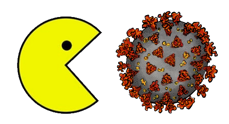

# Pac-Man édition coronavirus



## Réalisation

Ce jeu vous est présenté par :

- Julien Giraud (P1704709)
- Mériem Ghali (P1812188)

## Lancement du jeu

Le projet a été développé sur Java 8, il faut donc une JVM en version 8 (paquet openjdk-8-jre sur Linux)

Pour lancer le jeu depuis le code source il faut utiliser l'IDE NetBeans

Pour lancer le jeu depuis un exécutable, ouvrez une console dans le dossier Build puis ouvrez le .jar avec la JVM

```shell
# Exemple sur une machine avec plusieurs versions de Java
/usr/lib/jvm/java-8-openjdk-amd64/jre/bin/java -jar PM_Swing.jar
```

### Mode débug

Pour aller beaucoup plus vite nous avons développé une option de débug "--debug" qui permet de finir le jeu en une minute ou deux. Avec cette option vous pouvez tester toutes les conctionnalités du jeu en un minimum de temps

```shell
# Exemple console du mode débug
/usr/lib/jvm/java-8-openjdk-amd64/jre/bin/java -jar PM_Swing.jar --debug
```

## Principe du jeu

Le jeu se compose de 3 niveaux, à chaque niveau l'IA des fantômes devient plus efficace donc le niveau est plus difficile

Pour gagner il faut manger toutes les boules qui se trouve dans la map pour chacun des trois niveaux

### Surprise

Il y a un petit easter egg à la fin du jeu pour vous féliciter d'avoir échappé au Convid-19

## Comment jouer

1. Pour déplacer le Pac-Man, utilisez les flèches directionnelles de votre clavier
2. Pensez à utiliser le passage magique sur les côtés de la map
3. Pour gagner plus de points, mangez le fruit bonus
4. Pour gagner encore plus de points, mangez les superBoules (il y en a 4), elles vous protégeront contre le Convid-19 (c'est un peu comme du savon) et plus vous mangerez de fantômes plus votre score augmentera (200 -> 400 -> 800 -> 1600)
